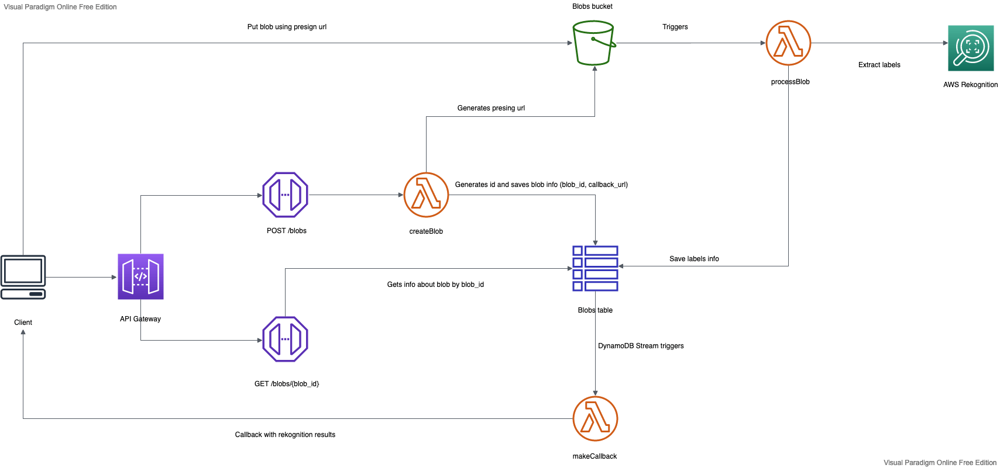

# Staircase skills assesment: Igor Brovtsin

## Differences with the original architecture
#### 1. Fetching blob information with Lambda instead of API Gateway
While AWS API Gateway offers a simple way to access `DynamoDB` tables data directly with `REST API`, I find that the `HTTP API + Lambda` combination is much cheaper per request under normal circumstances. One million requests with `REST API` will cost `$3.50`, while the same amount of `HTTP API` calls will cost `$1.00`, leaving `$2.50` for Lambda time. However, the cheapest (ARM+128M) lambda will do just fine for simple DB fetch and will need to spend `~1350ms` on each request (with measured cold start of `~200ms` and hot operation of `~20ms`) to exceed the budget of `$2.5`. Also, mixing both `REST API` and `HTTP API` in the same app doesn't look like a good idea to me.

#### 2. Simple cache for processBlob
As `Rekognition` is relatively expensive service, it could be cheaper to save recognized labels alongside the file checksum, so that repeated queries with the same file wouldn't result in extra `Rekognition` API queries. This comes at a cost of somewhat increased lambda times and extra `DynamoDB` storage required, but may save a decent amount of money in some cases.

The cache is contained in a separate `DynamoDB` table that has `S3` `eTags` as keys and result/error attributes. When an image is recognized successfully, an item that contains the labels is inserted to the table. The inserted item will be used as a result source for requests with the same file. As Amazon might improve `Rekognition` algorithms with time, these records will be ignored after a while (the lifetime is configurable). Recognition attempts that failed because of unsupported/broken/large files are also recorded, but unlike the successful ones, will be cached forever.

It is theoretically possible that `eTags` of two different images could be the same, as it is practically an `md5` checksum. However, unless the files were crafted that way intentionally, the possibility of two valid images having the same checksum is extremely low.

#### 3. Additional features
- When developing and testing API integrations, a developer might use self-signed HTTPS certificates on their callback server. However, by default, Python's HTTPS client will reject these certificates as it cannot verify their validity. In order to ignore SSL certificate verification errors when using HTTPS endpoint, an API client might send an additional parameter `allow_insecure_callback` to the `POST /blobs` endpoint so that the connection would still be encrypted (but without any security guarantees).

- As `makeCallback` currently makes requests synchronously, the time spent to wait for the response is billed as lambda computational time. As the default timeout of `30` seconds is a disaster cost-wise (`~$50` for 1kk requests without any actual compute), I've reduced the timeout to `5` seconds (`~$10` for 1kk). The request timeout is configurable via environment variables.

#### 4. Presigned URL generation
While it is possible to return a single URL that could be used to upload files, I chose to return the result of `generate_presigned_post` instead. The reason behind this is that I found it counter-intuitive and inconvenient to send binary data as `application/octet-stream` instead of `multipart/form-data`. Another improvement this change allowed is that we now can enforce file size limit on the uploaded files (instead of checking it afterwards). However, it changes `PUT` to `POST` in the original architecture and requires the client to send additional fields to the S3 endpoint. The response field name was also changed from `upload_url` to `upload_info` to better reflect the actual content of the object.

## Possible improvements
- Even with reduced timeout, `makeCallback` still blocks to process each callback event. To increase callback throughput, it might be a good idea to replace the current implementation with something asynchronous, so that lambda could handle incoming events while waiting for other callbacks to complete.

# Original requirements

## Skills Assessment: Building a simple API
Your task is to create a simple API for the recognition of images using AWS Rekognition on the back-end. Users for this API are other developers. The API stores an image does image recognition on it and returns results to the user in two ways, with a callback and a GET endpoint. You will demonstrate the API and its functionalities to our engineering teams, taking the perspective of an API user. 

### User Workflow
  1. Send request with optionally provided callback_url in request body. Response return unique upload_url.
  2. The user uploads a picture to the upload_url
  3. Once the image has been PUT to the upload_url, it gets stored in an S3 bucket. Once successfully stored, this will trigger the image recognition process. You can use AWS Rekognition or any other API for this.
  4. Once the image recognition process finishes, the user receives a callback under the callback_url they indicated in the first step
  5. User can also retrieve the results from a GET endpoint
  6. Create an Open API definition which documents your API

### Requirements

  - The deliverable should be in a GitHub repository
  - You should use the Serverless framework for describing infrastructure. As a user I should be able to deploy the service to any account with `sls deploy` (please do not use SAM)
  - Code needs to be written in Python, Java or another OOP language
  - This project needs to be built using only AWS services. Feel free to utilize anything available to you next to S3 and AWS Rekognition. Services outside of AWS are not acceptable.
  - If you choose to deviate from the workflow or the architecture proposal, please provide detailed explanations for your choices
  - Run through all the test cases (zip file at the bottom)
  - Make sure that you handle errors elegantly. Provide error messages to your users that help them plan next steps
    - What happens if they submit a wrong file?
    - What happens if the image recognition returns bad results?

